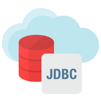

# Library-Manage-System
## Objective/ Vision 

A library management software where admin can add/view/delete librarian and librarian can add/view books, issue, view issued books and return books.
## Introduction

1. Implement a simple Library Manage System with the following function :

* Create user
* Login in user
* Sign out user
* View all books
* View all books borrowed by user
* Add bookItems
* Borrowed bookItems
* Return bookItems
* Search bookItems

2. Using TDD (Test-Driven Development) to develope  
`File : LibraryManageSystem/src/testing`  
* AllTests.java
* testAddBookItem.java
* testBorrowBooks.java
* testReturnBooks.java
* testSearchBookItem.java
* testShowBookItems.java
* testShowBooksBorrowedByUser.java
* testUserLogin.java
* testUserRegister.java  
#### execute `AllTests.java` to test all Unit

## Setup
#### 1. Download and setup MySQL  
Reference : https://clay-atlas.com/blog/2019/11/16/mysql-mysqlworkbench-tutorial-download-install-steps/

#### 2. Import Database  
Import `Dump20210610.sql` into database  
`Toolbar : Server >> Data Import`  
  


#### 3. Set Database userAccount and userPassword  
`File : LibraryManageSystem/src/development/jdbcConnection.java`  
Modify `String dbUser = "root";` `String daPassword = "jeethu123";` to your own dbUser and dbPassword  
```java
public static Connection dataBaseConnection() {
  Connection myConnection = null;
  String url = "jdbc:mysql://localhost:3306/librarymanagesystemdb";
  String dbUser = "root";
  String daPassword = "jeethu123";
  try {
    //Get a connection to DB
    myConnection = DriverManager.getConnection(url, dbUser, daPassword);

  } catch (Exception e) {
    e.printStackTrace();
  }

  return myConnection;
}
```

#### 4. Execute `File : LibraryManageSystem/src/development/GUI.java` and it **WILL** work !!!

## Operating Procedures  
#### 1. Login Interface  
Click `Register` to sign up a user account  

  

#### 2. Register Interface  
Enter `User Account` , `User Password` and click `Sign Up`  

  

### 3. User Login  
Enter `User Account` , `User Password` and click `Sign In`  

  

### 4. View All BookItem  
Click `View All` to show all bookItems  

  

### 5. Search BookItem
Enter `Book Name` or `Author` to find the bookItem

  

### 6. Borrow BookItem
Click `Borrow` to borrow bookItem  

  

### 7. View All BookItem  
Click `My Book` to show all bookItem borrowed by user  

  

### 8. Return BookItem
Click `Return` to borrow bookItem  

  

### 9. Add BookItem
Click `Sign Out` and login with User Account : `admin` User Password : `1234`  

  

Click `Add Book` and enter `Book Name` , `Author` and `Inventory`  

  

  


## Tools Used 🛠
<table align="center">

<br>
    
  <tr>
     <td align="center" width="100">
        
      <br>Java 
    </td>
      <td align="center" width="100">
        
      <br>My SQL
    </td>
   <td align="center" width="100">
        
      <br>JDBC
    </td>
   </tr>
   <tr>
<td align="center" width="100">
        
      <br>Swing
    </td>    
<td align="center" width="100">
        
      <br>Eclipse
    </td>
<td align="center" width="100">
        
      <br>GitHub
    </td> 
  </tr> 

  </table>

<br>

